# Architecture 

### Design

#### mica control flow

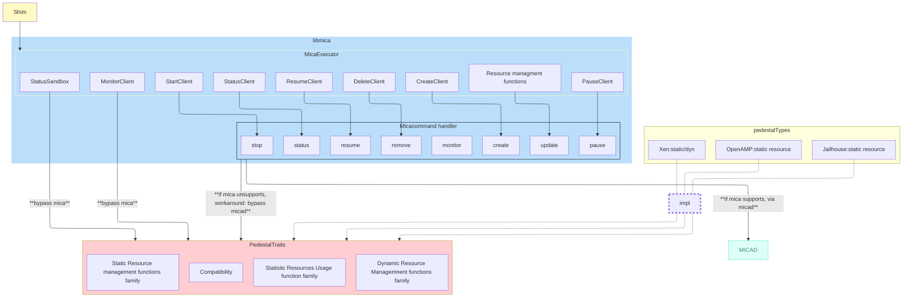

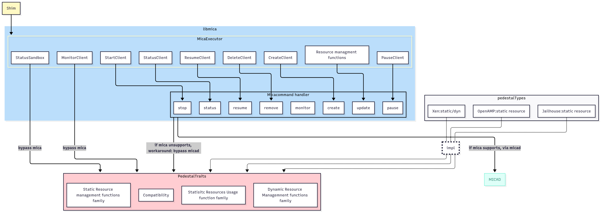

#### configs

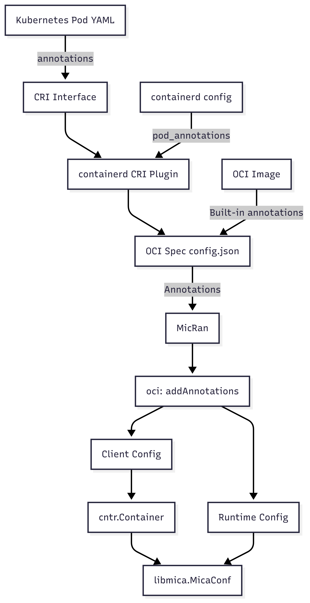

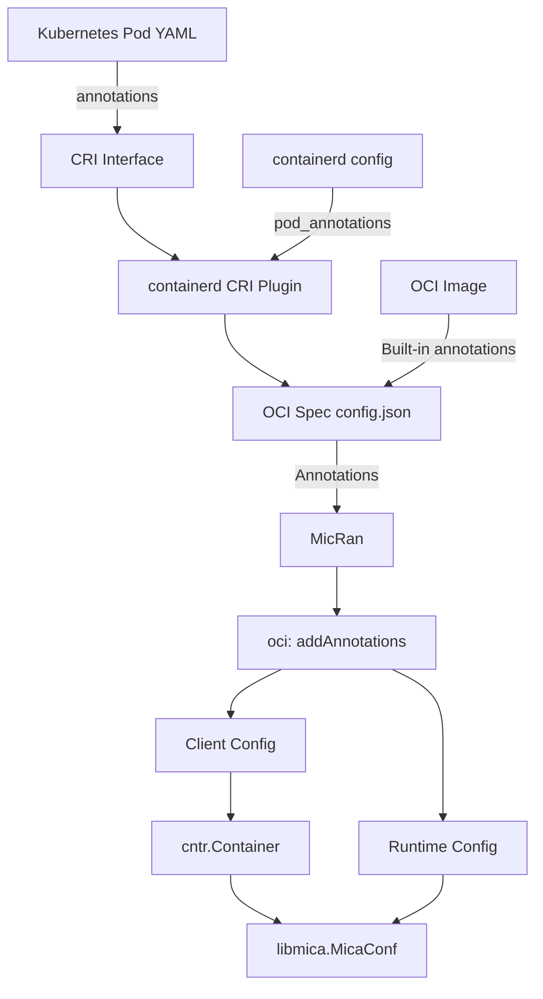

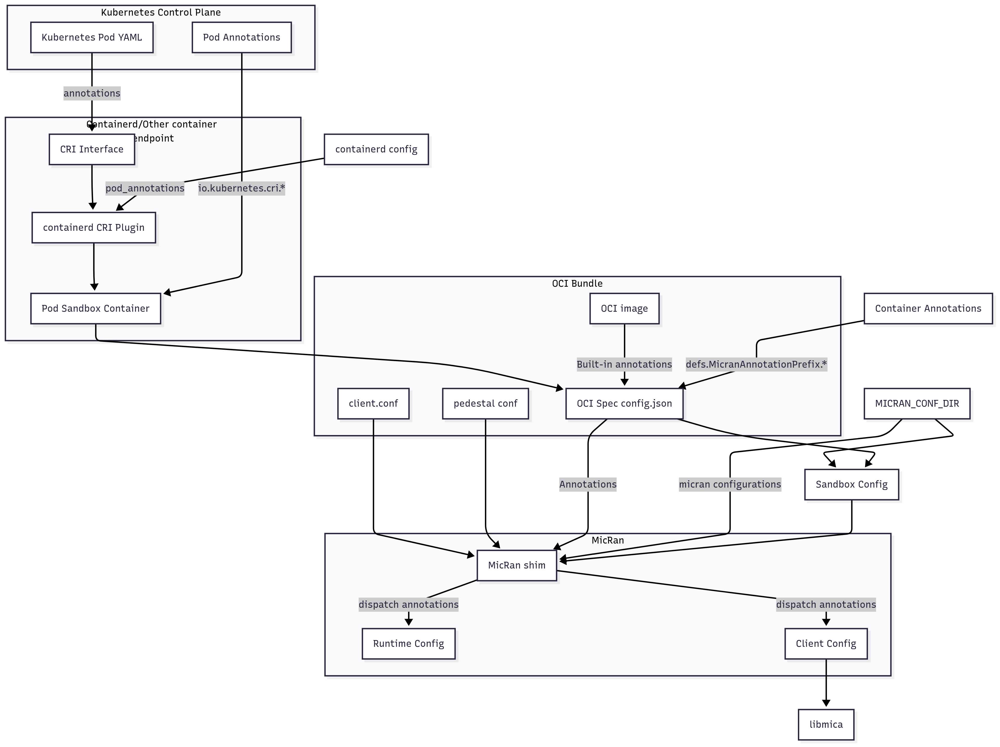

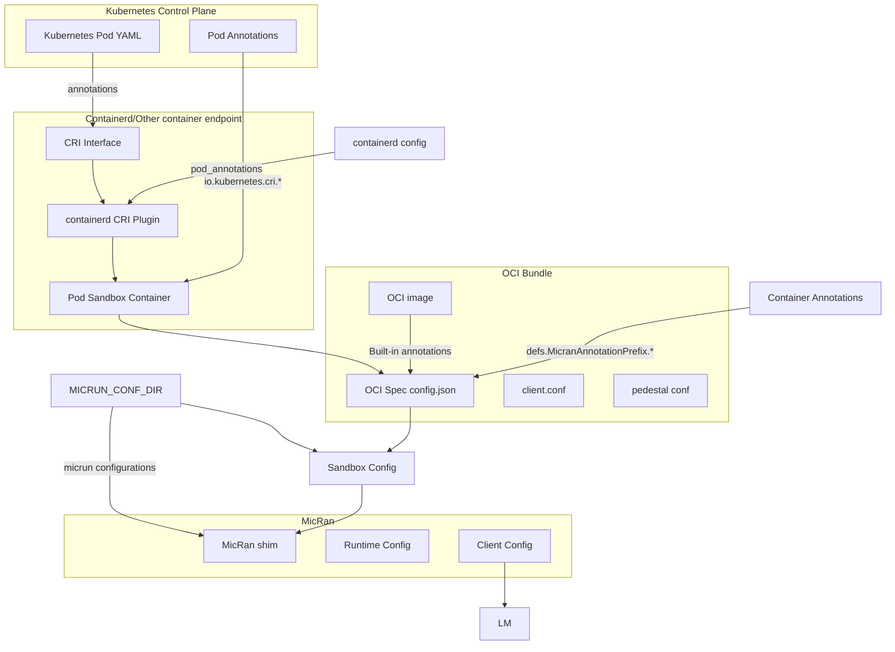

#### 详细解析流程

`shimService.create()`
1. oci.Spec loadOCISpec()
1. ctype, annotations <- oci.Spec
1. oci.RuntimeConfig <- loadRuntimeConfig(id string, annotations map[string]string)

```
runtimeConfig := loadRuntimeConfig(ctx, id, annotations, opts)
      ├── oci.GetSandboxConfigPath(annotations)  // Pod annotation
      ├── typeurl.UnmarshalAny(opts.Options)    // Containerd options
      ├── os.Getenv("MICRUN_CONF_FILE")           // Environment override
      └── LoadMicrunConfiguration(path|dir)      // Config files
```

Micrun 配置文件加载顺序：

1. `MICRUN_CONF_FILE` 指向的显式文件；
2. `MICRUN_CONF_DIR` 目录下的所有 `.ini` 文件，按文件名排序；
3. 默认的 drop-in 目录 `/etc/micrun/conf.d`；
4. `/etc/micrun/micrun.ini`。

找到的多个文件会依序应用，之后再由 Pod/Sandbox 注解覆盖。

根据ctype分类处理

##### Regular container

```
sandboxConfig <- oci.SandboxConfig(oci.Spec, runtimeConfig, ...)
sandbox <- createSandbox(oci.Spec, runtimeConfig, ...) 需要简化，尽量减少有先后关系的解析函数的参数正交
      ├── cntr.CreateSandbox(sandboxConfig)        // micantainer package sandbox creationg entry
      │   ├── createSandboxFromConfig()
      │   │   ├── micadCheckAndStart()                  // micad setup
      │   │   └── createContainers()            // Create containers
      │   └── Return sandbox
      └── cntr.newContainer()                        // Container
```

##### Sandbox container

```
resources := oci.CalculateSandboxSizing(annotations)
    ├── annotations["io.kubernetes.cri.sandbox-cpu-period"]
    ├── annotations["io.kubernetes.cri.sandbox-cpu-quota"]
    └── annotations["io.kubernetes.cri.sandbox-memory"]

sandboxConfig <- oci.SandboxConfig(oci.Spec, runtimeConfig, ...)
```


##### Pod Container creation


### Latest

overview
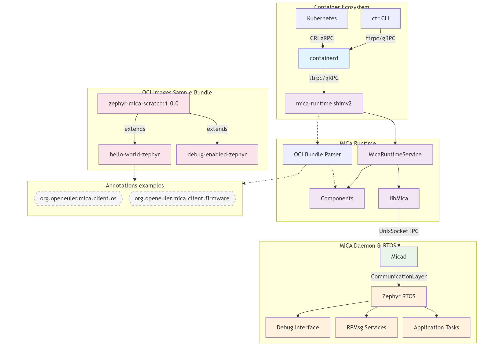

expanded
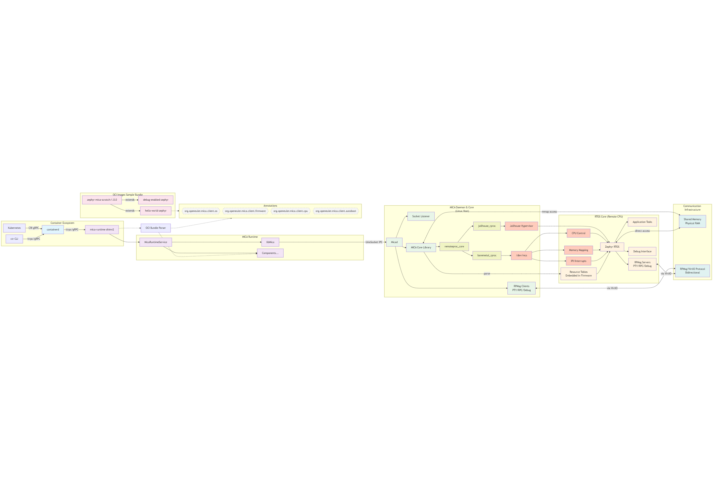

### Cloud-Edge Architecture Overview

The following diagram shows micrun's role in a Kubernetes/KubeEdge environment:

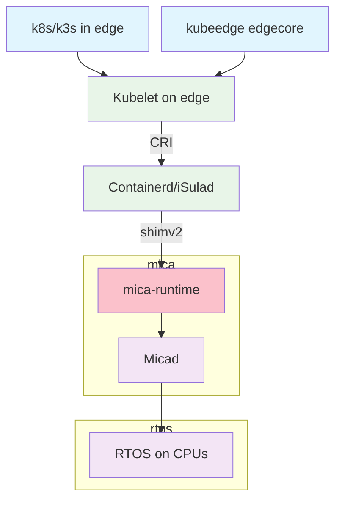

#f0088f8c


### Key Components
1. **Kubernetes Cluster**: Manages container deployments
2. **Edge Nodes**: Run container workloads
3. **micrun**: Converts container requests to RTOS operations
4. **Micad**: MICA daemon managing RTOS instances
5. **RTOS**: Real-time OS instances on dedicated CPUs

### Usage Case: 3-CPU Edge Device

The following diagram shows a specific deployment scenario with 4 CPUs:

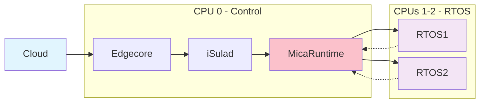

## containerd

### in-Eco role

### DEMO 0.2 0623 overview

micrun
::package core
    :: shim
    :: runtime
    :: bundleParser

```mermaid
%%{init: {'theme':'auto', 'flowchart':{'nodeSpacing': 15, 'rankSpacing': 30, 'curve': 'basis'}}}%%
flowchart LR
    subgraph ContainerEco ["Container Ecosystem"]
        Containerd[containerd] --> |ttrpc/gRPC|MicaShim[mica-runtime shimv2]
        Kubernetes[Kubernetes] --> |CRI gRPC|Containerd
        CtrCLI[ctr CLI] --> |ttrpc/gRPC|Containerd
    end
   
    subgraph OCIImages ["OCI Images Sample Bundle"]
        BaseImage[zephyr-mica-scratch:1.0.0]
        BaseImage --> |extends|DebugApp[debug-enabled-zephyr]
        BaseImage --> |extends|HelloWorldApp[hello-world-zephyr]
    end
    
    subgraph MicaRuntime ["MICA Runtime"]
        BundleParser[OCI Bundle Parser]
        MicaShim --> RuntimeService[MicaRuntimeService]
        RuntimeService --> MicaClient[libMica]
        RuntimeService --> Components[Components]
        MicaShim -.-> BundleParser
    end
    
    subgraph MicaDaemonScope ["MICA Daemon & RTOS"]
        MicaDaemon[Micad]
        MicaClient --> |UnixSocket IPC|MicaDaemon
        MicaDaemon --> |CommunicationLayer|ZephyrRTOS[Zephyr RTOS]
        ZephyrRTOS --> AppTasks[Application Tasks]
        ZephyrRTOS --> RPMsgServices[RPMsg Services]
        ZephyrRTOS --> DebugInterface[Debug Interface]
    end
    
    subgraph Annotations ["Annotations examples"]
        OSAnnotation{{"org.openeuler.mica.client.os"}}
        FirmwareAnnotation{{"org.openeuler.mica.client.firmware"}}
    end
    
    HelloWorldApp -.-> Annotations
    BundleParser -.-> Annotations
    BundleParser -.-> Components
    
    %% Container Ecosystem styles
    style Containerd fill:#e1f5fe
    
    %% MICA Runtime styles (consistent for all runtime components)
    style MicaShim fill:#f3e5f5
    style RuntimeService fill:#f3e5f5
    style MicaClient fill:#f3e5f5
    style Components fill:#f3e5f5

    %% MICA Daemon styles
    style MicaDaemon fill:#e8f5e8
    
    %% RTOS Core styles
    style ZephyrRTOS fill:#fff3e0
    style AppTasks fill:#fff3e0
    style RPMsgServices fill:#fff3e0
    style DebugInterface fill:#fff3e0
    
    %% OCI Images styles
    style BaseImage fill:#fce4ec
    style HelloWorldApp fill:#fce4ec
    style DebugApp fill:#fce4ec
    
    %% Annotation styles (configuration data, not components)
    style OSAnnotation fill:#f5f5f5,stroke:#999,stroke-dasharray: 5 5
    style FirmwareAnnotation fill:#f5f5f5,stroke:#999,stroke-dasharray: 5 5
```

### DEMO 0.2 0623 expanded
> shim : Converter(parer) + runtime 两个部分我们会整合在一起

```mermaid
%%{init: {'theme':'auto', 'flowchart':{'nodeSpacing': 15, 'rankSpacing': 25, 'curve': 'basis'}}}%%
flowchart TD
    subgraph ContainerEco ["Container Ecosystem"]
        Containerd[containerd] --> |ttrpc/gRPC|MicaShim[mica-runtime shimv2]
        Kubernetes[Kubernetes] --> |CRI gRPC|Containerd
        CtrCLI[ctr CLI] --> |ttrpc/gRPC|Containerd
    end
    
    subgraph OCIImages ["OCI Images Sample Bundle"]
        BaseImage[zephyr-mica-scratch:1.0.0]
        BaseImage --> |extends|DebugApp[debug-enabled-zephyr]
        BaseImage --> |extends|HelloWorldApp[hello-world-zephyr]
    end
    
    subgraph MicaRuntime ["MICA Runtime"]
        BundleParser
        MicaShim --> RuntimeService[MicaRuntimeService]
        RuntimeService --> MicaClient[libMica]
        RuntimeService --> Components[Components...]
    end
    
    subgraph MicaDaemonSG ["MICA Daemon & Core (Linux Host)"]
        MicaDaemon[Micad]
        MicaClient --> |UnixSocket IPC|MicaDaemon
        MicaDaemon --> SocketListener[Socket Listener]
        MicaDaemon --> MicaCore[MICA Core Library]
        MicaDaemon --> LinuxRPMsgServices[RPMsg Clients<br/>PTY/RPC/Debug]
        
        MicaCore --> RemoteProcCore[remoteproc_core]
        RemoteProcCore --> BaremetalRproc[baremetal_rproc]
        RemoteProcCore --> JailhouseRproc[jailhouse_rproc]
        BaremetalRproc --> McsDevice["/dev/mcs"]
        JailhouseRproc --> JailhouseHypervisor[Jailhouse Hypervisor]
    end
    
    subgraph CommunicationInfra ["Communication Infrastructure"]
        SharedMemoryHW[Shared Memory<br/>Physical RAM]
        RPMsgProtocol[RPMsg/VirtIO Protocol<br/>Bidirectional]
    end
    
    subgraph RTOSCore ["RTOS Core (Remote CPU)"]
        RTOSResourceTable[Resource Tables<br/>Embedded in Firmware]
        McsDevice --> CPUControl[CPU Control]
        McsDevice --> MemoryMapping[Memory Mapping]
        McsDevice --> IPIInterrupts[IPI/Interrupts]
        JailhouseHypervisor --> ZephyrRTOS[Zephyr RTOS]
        CPUControl --> ZephyrRTOS
        MemoryMapping --> ZephyrRTOS
        IPIInterrupts --> ZephyrRTOS
        ZephyrRTOS --> AppTasks[Application Tasks]
        ZephyrRTOS --> RTOSRPMsgServices[RPMsg Servers<br/>PTY/RPC/Debug]
        ZephyrRTOS --> DebugInterface[Debug Interface]
        RTOSResourceTable --> ZephyrRTOS
    end
    
    %% Communication connections
    MicaCore <--> |mmap access|SharedMemoryHW
    ZephyrRTOS <--> |direct access|SharedMemoryHW
    LinuxRPMsgServices <--> |via VirtIO|RPMsgProtocol
    RTOSRPMsgServices <--> |via VirtIO|RPMsgProtocol
    MicaCore --> |parse|RTOSResourceTable
    
    subgraph Annotations ["Annotations"]
        OSAnnotation{{"org.openeuler.mica.client.os"}}
        FirmwareAnnotation{{"org.openeuler.mica.client.firmware"}}
        CPUAnnotation{{"org.openeuler.mica.client.cpu"}}
        AutobootAnnotation
