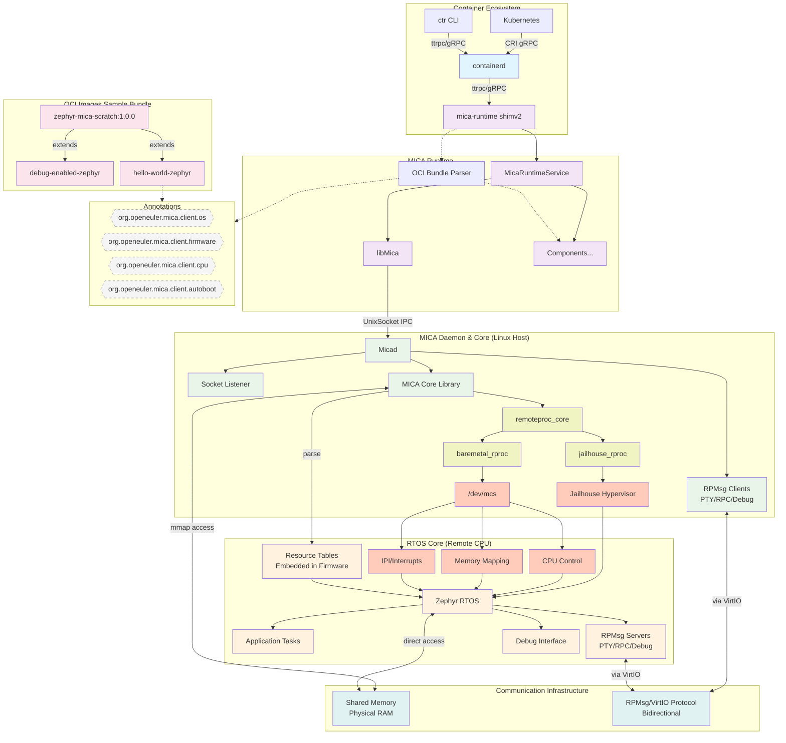

# Architecture 

## Latest

overview

expanded

## Logs

### DEMO 0.2 0623 overview

mica-shim
::package core
    :: shim
    :: runtime
    :: bundleParser

```mermaid
%%{init: {'theme':'auto', 'flowchart':{'nodeSpacing': 15, 'rankSpacing': 30, 'curve': 'basis'}}}%%
flowchart LR
    subgraph ContainerEco ["Container Ecosystem"]
        Containerd[containerd] --> |ttrpc/gRPC|MicaShim[mica-runtime shimv2]
        Kubernetes[Kubernetes] --> |CRI gRPC|Containerd
        CtrCLI[ctr CLI] --> |ttrpc/gRPC|Containerd
    end
   
    subgraph OCIImages ["OCI Images Sample Bundle"]
        BaseImage[zephyr-mica-scratch:1.0.0]
        BaseImage --> |extends|DebugApp[debug-enabled-zephyr]
        BaseImage --> |extends|HelloWorldApp[hello-world-zephyr]
    end
    
    subgraph MicaRuntime ["MICA Runtime"]
        BundleParser[OCI Bundle Parser]
        MicaShim --> RuntimeService[MicaRuntimeService]
        RuntimeService --> MicaClient[libMica]
        RuntimeService --> Components[Components]
        MicaShim -.-> BundleParser
    end
    
    subgraph MicaDaemonScope ["MICA Daemon & RTOS"]
        MicaDaemon[Micad]
        MicaClient --> |UnixSocket IPC|MicaDaemon
        MicaDaemon --> |CommunicationLayer|ZephyrRTOS[Zephyr RTOS]
        ZephyrRTOS --> AppTasks[Application Tasks]
        ZephyrRTOS --> RPMsgServices[RPMsg Services]
        ZephyrRTOS --> DebugInterface[Debug Interface]
    end
    
    subgraph Annotations ["Annotations examples"]
        OSAnnotation{{"org.openeuler.mica.client.os"}}
        FirmwareAnnotation{{"org.openeuler.mica.client.firmware"}}
    end
    
    HelloWorldApp -.-> Annotations
    BundleParser -.-> Annotations
    BundleParser -.-> Components
    
    %% Container Ecosystem styles
    style Containerd fill:#e1f5fe
    
    %% MICA Runtime styles (consistent for all runtime components)
    style MicaShim fill:#f3e5f5
    style RuntimeService fill:#f3e5f5
    style MicaClient fill:#f3e5f5
    style Components fill:#f3e5f5

    %% MICA Daemon styles
    style MicaDaemon fill:#e8f5e8
    
    %% RTOS Core styles
    style ZephyrRTOS fill:#fff3e0
    style AppTasks fill:#fff3e0
    style RPMsgServices fill:#fff3e0
    style DebugInterface fill:#fff3e0
    
    %% OCI Images styles
    style BaseImage fill:#fce4ec
    style HelloWorldApp fill:#fce4ec
    style DebugApp fill:#fce4ec
    
    %% Annotation styles (configuration data, not components)
    style OSAnnotation fill:#f5f5f5,stroke:#999,stroke-dasharray: 5 5
    style FirmwareAnnotation fill:#f5f5f5,stroke:#999,stroke-dasharray: 5 5
```

### DEMO 0.2 0623 expanded
> shim : Converter(parer) + runtime 两个部分我们会整合在一起

